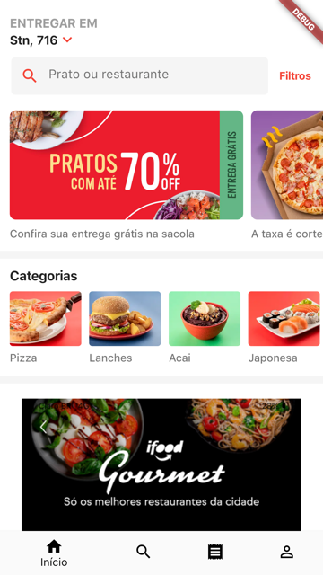

# ifood_flutter

Interface do aplicativo Ifood feita com Flutter.

## 🎥 Youtube

Quer saber mais detalhes? Acesse o [vídeo](https://youtu.be/q8aXy75--Pk).

## 📷 Screenshots

| Original| Flutter|
| --------|--------|
|||
